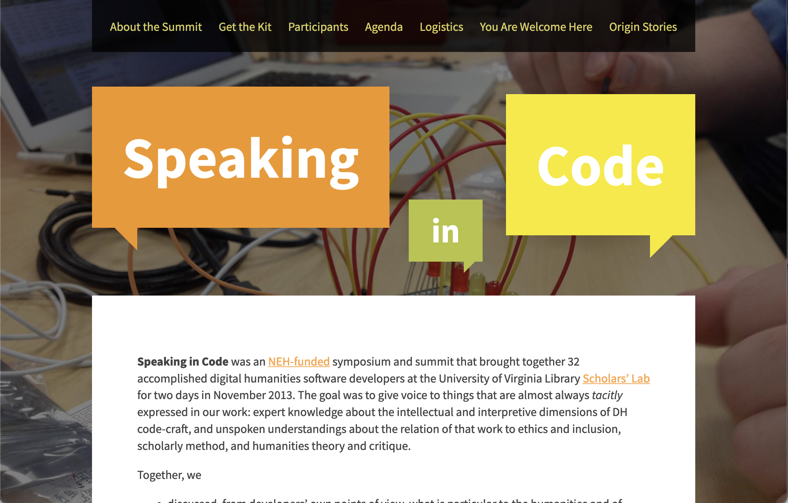
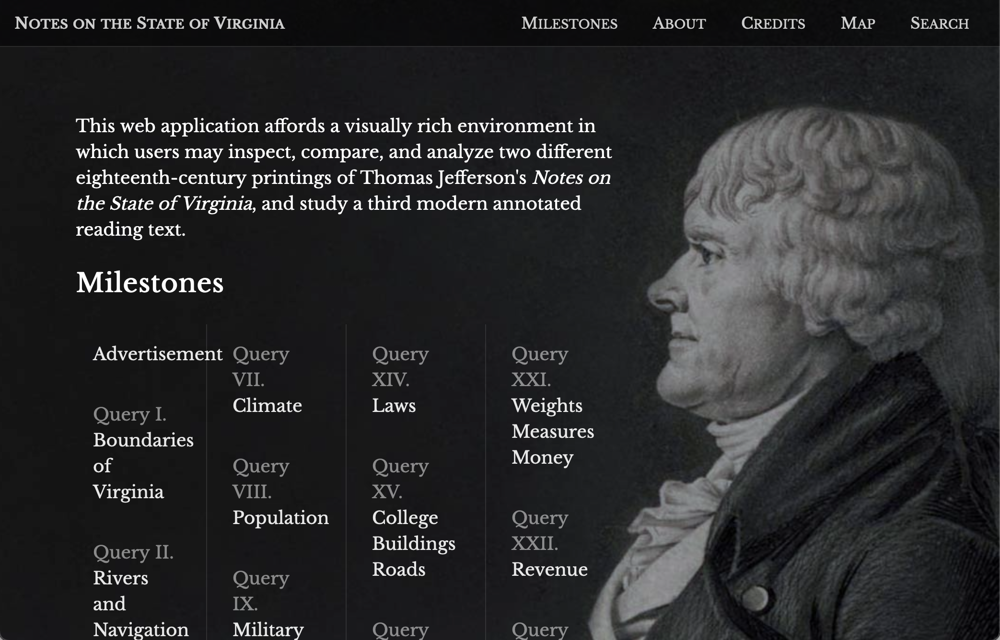
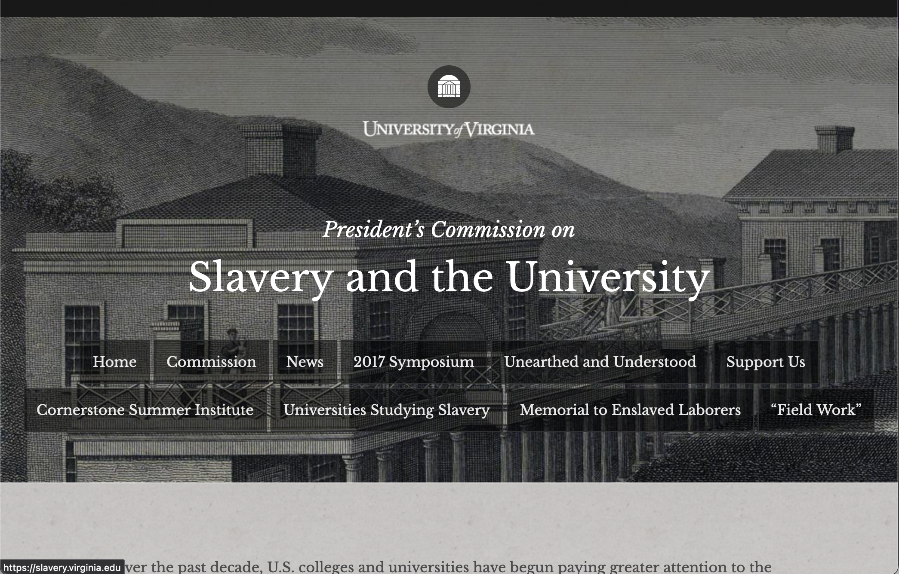

## Introduction

Hello! I'm Jeremy Boggs, the Head of Research and Development in the Scholars' Lab, at the University of Virginia Library. My research interests include feminist interface design, explorations of history, culture, and identity in table-top role-playing games, especially Dungeons & Dragons.

## Projects

### Practicum Project: 

[Speaking in Code](https://codespeak.scholarslab.org) Quis hoc dicit? Hoc non est positum in nostra actione. Immo videri fortasse. Atqui haec patefactio quasi rerum opertarum, cum quid quidque sit aperitur, definitio est.

### Coursework Projects

[Notes on the State of Virginia](https://notes.scholarslab.org)

Lorem ipsum dolor sit amet, consectetur adipiscing elit. Nam quibus rebus efficiuntur voluptates, eae non sunt in potestate sapientis. Si autem id non concedatur, non continuo vita beata tollitur. Duo Reges: constructio interrete.

[President's Commission on Slavery and the University](https://slavery.virginia.edu)

Tamen a proposito, inquam, aberramus. Tertium autem omnibus aut maximis rebus iis, quae secundum naturam sint, fruentem vivere. Itaque hic ipse iam pridem est reiectus

## Relevant Writing

- "Lorem Ipsum Dolor Sit Amet"
- "Duo Reges: constructio interrete."
- "Nam quibus rebus efficiuntur voluptates"